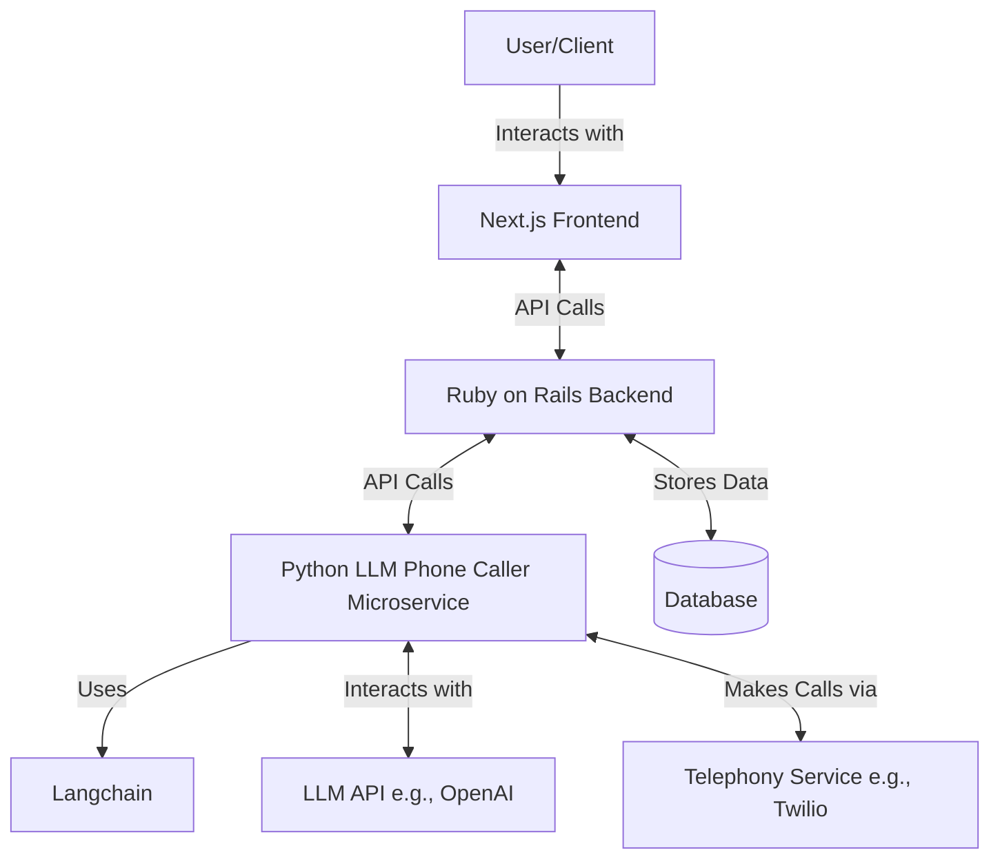

## Context

Your current project stack of Next.js frontend and Ruby on Rails backend is a solid foundation for building a modern, scalable web application. Let's consider how to best integrate an LLM-based phone caller into this architecture.

For the LLM phone caller microservice, we have several options to consider. Let's evaluate each:

	1. Ruby-based solution:
	Pros:
	- Consistency with your backend
	- Easier integration with existing Ruby on Rails codebase
	- Familiarity if you're already comfortable with Ruby
	
	Cons:
	- Fewer LLM-specific libraries compared to Python
	- May require more custom implementation
	
	2. Python with Langchain:
	Pros:
	- Langchain provides powerful abstractions for working with LLMs
	- Rich ecosystem of AI and ML libraries in Python
	- Good performance for AI/ML tasks
	
	Cons:
	- Introduces a new language to your stack
	- May require additional setup for integration with Ruby on Rails
	
	3. Existing GitHub project as a microservice:
	Pros:
	- Potentially faster implementation if you find a well-maintained project
	- Benefit from community contributions and updates
	
	Cons:
	- Less control over the codebase
	- May require modifications to fit your specific needs
	- Potential licensing issues

## Recommendation:
Given your current stack and the complexity of LLM-based systems, I recommend using Python with Langchain for your LLM phone caller microservice. Here's why:

1. Powerful LLM tools: Langchain provides excellent abstractions for working with LLMs, which can significantly speed up development and improve maintainability.

2. Flexibility: Python's rich ecosystem allows for easy integration of other AI/ML libraries if needed in the future.

3. Performance: Python is well-suited for AI/ML tasks and can handle the computational requirements of LLM interactions efficiently.

4. Microservice architecture: By implementing this as a separate microservice, you maintain a clear separation of concerns and can scale this component independently.

Here's a high-level architecture of how this could work:

In this architecture:

1. The Next.js frontend provides the user interface for managing the system.
2. The Ruby on Rails backend handles business logic, data management, and orchestrates the overall system.
3. The Python LLM Phone Caller microservice is responsible for:
   - Generating call scripts using the LLM
   - Making and receiving phone calls via a telephony service
   - Processing speech-to-text and text-to-speech
   - Managing the conversation flow

To integrate this with your existing stack:

1. Develop the Python microservice with a RESTful API or gRPC interface.
2. Use Docker to containerize the microservice for easy deployment and scaling.
3. Implement API endpoints in your Rails backend to communicate with the microservice.
4. Use a message queue (e.g., RabbitMQ, Redis) for asynchronous communication between Rails and the microservice if needed.

This approach allows you to leverage the strengths of both your existing stack and the Python ecosystem for LLM development, while maintaining a clean separation of concerns.

Would you like more details on any part of this architecture or guidance on implementing specific components?