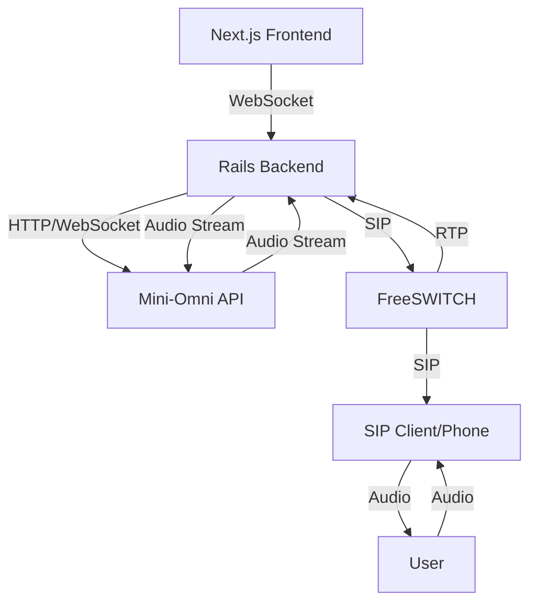
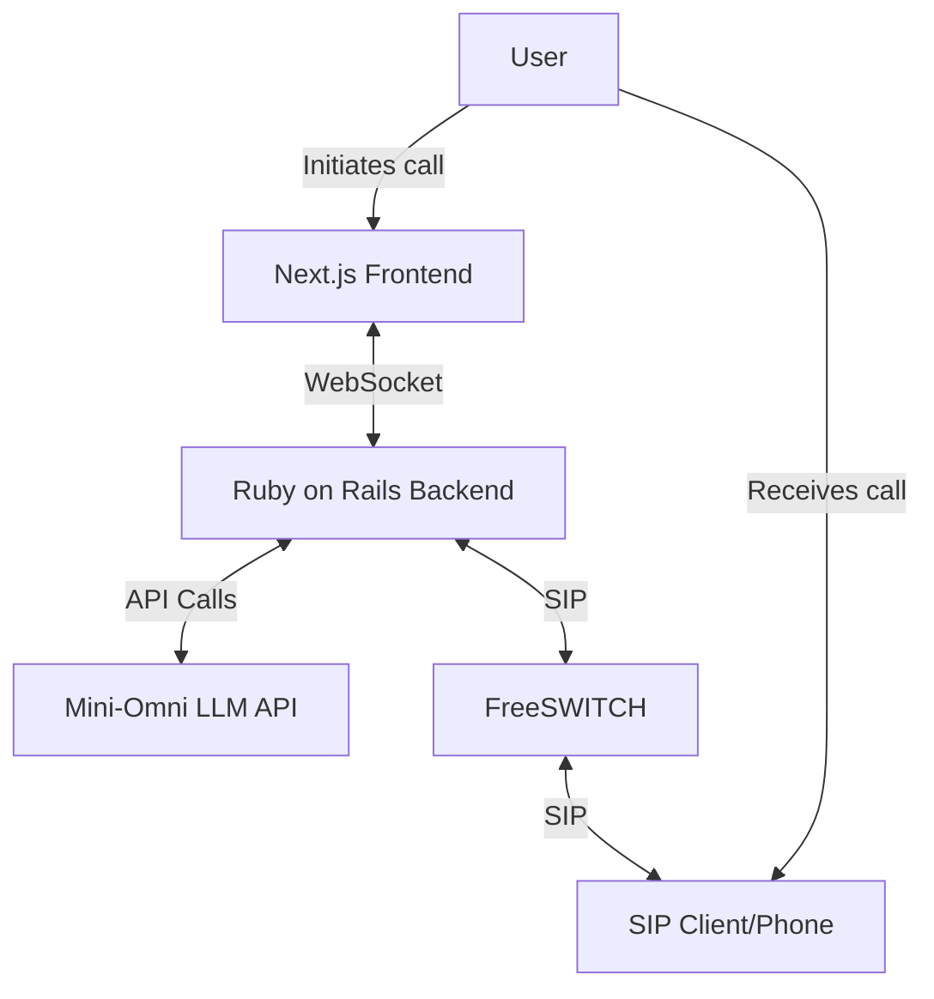

---

# Phonify - Simulated Telephony Environment

## Overview
Phonify is a simulated telephony environment designed to facilitate the development and testing of the ISS Appointment Setter. It leverages FreeSWITCH to create a mock phone system, allowing for realistic testing of AI-driven conversations without incurring real-world telephony costs. This system integrates with our existing Next.js frontend, Ruby on Rails backend, and the Mini-Omni LLM API to provide a complete end-to-end testing environment for our AI appointment setting service.

## User Story
AS A developer working on the ISS Appointment Setter
I WANT a simulated phone system that integrates with our AI backend
SO THAT I can test and refine our AI-driven appointment setting conversations without incurring real-world call costs

## Acceptance Criteria
- [ ] [[FreeSwitch Server - MVP critical, refining, and enterprise-production documentation and files]]
- [ ] [[Set up Default FreeSWITCH config in Docker]]
- [ ] [[Integrate FreeSWITCH with Rails backend]]
- [ ] [[Implement SIP client in Next.js frontend]]
- [ ] [[Create mock call initiation and receiving interface]]
- [ ] [[Integrate Mini-Omni processing into mock call flow]]
- [ ] [[Implement audio streaming between components]]
- [ ] [[Set up logging and monitoring for mock calls]]
- [ ] [[Create automated test suite for common conversation scenarios]]
- [ ] [[Document usage and testing procedures for the team]]

---
## Important Resources
### Before deploying to production
[freeswitch virtualization guide](https://github.com/signalwire/freeswitch-docs/blob/main/docs/FreeSWITCH-Explained/Installation/Virtualization/index.mdx)  <-- read before deploying to production cloud
- see also [virtualization experiences](https://github.com/signalwire/freeswitch-docs/blob/main/docs/FreeSWITCH-Explained/Installation/Virtualization/Virtualization-Experiences_10289484.mdx#lxc)
[enterprise deployment](https://github.com/signalwire/freeswitch-docs/tree/main/docs/FreeSWITCH-Explained/Enterprise-Deployment) 
[mod_xml_curl](https://github.com/signalwire/freeswitch-docs/blob/main/docs/FreeSWITCH-Explained/Modules/mod_xml_curl_1049001.mdx)

### Important claude conversations
[freeswitch examples and our app context in a full stack paradigm](https://claude.ai/chat/62f5f253-7004-4551-a7a7-2888e33d929c)

## Questions to answer
- [ ] [[How to set up ESL library for freeswitch (lua vs ruby)]]
- [ ] [[should freeswitch handle database interactions]]
