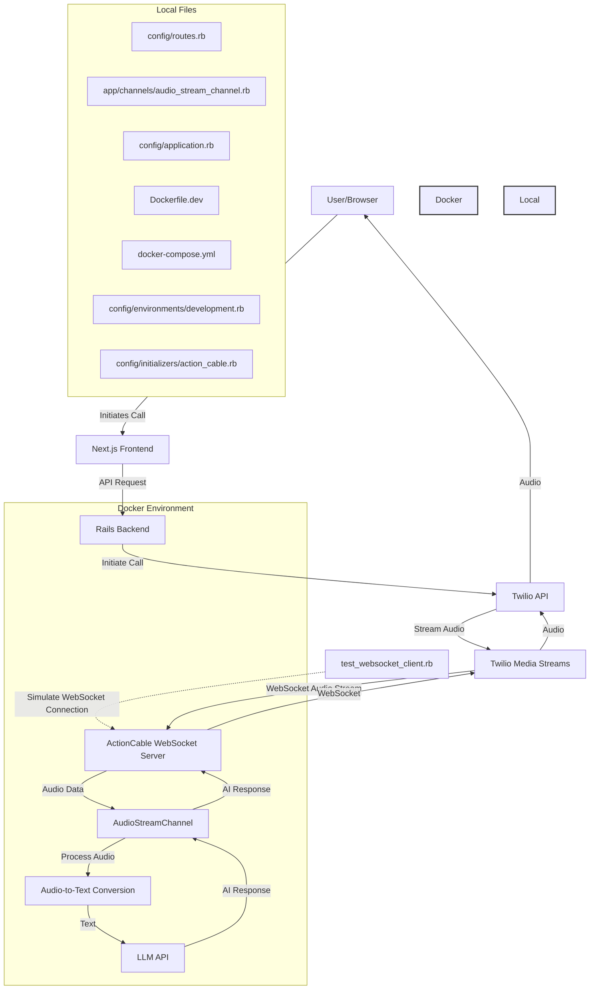

## old

[[Set up SIP-based phone system for ISS Appointment Setter]]


 Let's explore how we can build the app to handle phone calls from the start while avoiding charges during development. :

1. Use a VoIP (Voice over IP) library:
Instead of using the Web Audio API, we can use a VoIP library like JsSIP or SIP.js. These libraries allow us to simulate phone calls entirely within the browser or between browsers.

2. Set up a SIP server:
We can use a free, open-source SIP server like Asterisk or FreeSWITCH. This will allow us to route calls between different parts of our system without incurring any charges.

3. Implement a softphone interface:
We'll create a softphone interface in our Next.js frontend. This will look and behave like a phone interface, allowing us to simulate real phone calls.

4. Mock PSTN integration:
We'll create a mock Public Switched Telephone Network (PSTN) integration. This will allow us to simulate incoming and outgoing calls to "real" phone numbers without actually connecting to the telephone network.

Here's a breakdown of the implementation steps:

1. Set up the SIP server:
   - Install and configure Asterisk or FreeSWITCH on a server or locally for development.

2. Update the frontend:
   - Install a SIP library:
     ```bash
     npm install jssip
     ```

   - Create a new hook for handling SIP calls (`src/hooks/useSipCall.ts`):

     ```typescript
     import { useState, useEffect } from 'react';
     import JsSIP from 'jssip';

     export const useSipCall = () => {
       const [phoneStatus, setPhoneStatus] = useState('idle');
       const [currentSession, setCurrentSession] = useState(null);

       useEffect(() => {
         // Configure the SIP connection
         const socket = new JsSIP.WebSocketInterface('ws://your-sip-server:8088/ws');
         const configuration = {
           sockets: [socket],
           uri: 'sip:user@your-sip-server',
           password: 'your-password'
         };

         const userAgent = new JsSIP.UA(configuration);

         userAgent.on('connected', () => setPhoneStatus('connected'));
         userAgent.on('disconnected', () => setPhoneStatus('disconnected'));
         userAgent.on('newRTCSession', (data) => {
           const session = data.session;
           setCurrentSession(session);
           setPhoneStatus('ringing');
           
           session.on('accepted', () => setPhoneStatus('ongoing'));
           session.on('ended', () => {
             setPhoneStatus('idle');
             setCurrentSession(null);
           });
         });

         userAgent.start();

         return () => {
           userAgent.stop();
         };
       }, []);

       const makeCall = (number) => {
         if (phoneStatus === 'connected') {
           const options = {
             mediaConstraints: { audio: true, video: false }
           };
           currentSession.call(number, options);
         }
       };

       const answerCall = () => {
         if (currentSession) {
           currentSession.answer({ mediaConstraints: { audio: true, video: false } });
         }
       };

       const hangUp = () => {
         if (currentSession) {
           currentSession.terminate();
         }
       };

       return { phoneStatus, makeCall, answerCall, hangUp };
     };
     ```

   - Update the dashboard component (`src/app/dashboard/page.tsx`):

     ```tsx
     'use client';

     import { useState } from 'react';
     import { useSipCall } from '../../hooks/useSipCall';

     export default function Dashboard() {
       const { phoneStatus, makeCall, answerCall, hangUp } = useSipCall();
       const [number, setNumber] = useState('');

       return (
         <div className="p-4">
           <h1 className="text-2xl font-bold mb-4">Phone Dashboard</h1>
           <div className="space-y-4">
             <p>Status: {phoneStatus}</p>
             <input
               type="text"
               value={number}
               onChange={(e) => setNumber(e.target.value)}
               placeholder="Enter phone number"
               className="border p-2 rounded"
             />
             <button
               onClick={() => makeCall(number)}
               className="bg-blue-500 text-white px-4 py-2 rounded mr-2"
             >
               Call
             </button>
             <button
               onClick={answerCall}
               className="bg-green-500 text-white px-4 py-2 rounded mr-2"
             >
               Answer
             </button>
             <button
               onClick={hangUp}
               className="bg-red-500 text-white px-4 py-2 rounded"
             >
               Hang Up
             </button>
           </div>
         </div>
       );
     }
     ```

3. Update the backend:
   - Create a new controller to handle SIP events and integrate with the LLM API.
   - Implement endpoints for call events (new call, call ended, etc.)

4. Integrate with the LLM API:
   - When a call is established, start streaming audio to the LLM API.
   - Receive responses from the LLM API and send them back through the SIP call.

5. Create a mock PSTN integration:
   - Implement a service that simulates incoming calls from "real" phone numbers.
   - Allow outgoing calls to be routed to this mock service instead of actual phone numbers.

This approach allows us to:
1. Build a system that closely mimics real phone call behavior from the start.
2. Test and refine our model in a setup very similar to the final product.
3. Avoid charges associated with actual phone calls during development.
4. Easily transition to a real telephony service (like Twilio) when we're ready, by replacing our mock PSTN integration.

To implement this, we'll need to:
1. Set up the SIP server (Asterisk or FreeSWITCH) in our development environment.
2. Modify our Docker setup to include the SIP server.
3. Implement the frontend changes as described above.
4. Create the necessary backend services to handle SIP events and interact with the LLM API.

This approach will require more initial setup, but it will result in a system that's much closer to our end goal from the beginning. It will allow us to test and refine the core functionality of our appointment setting AI in a realistic phone call scenario without incurring any charges.

Would you like to proceed with this approach? If so, we can start by setting up the SIP server and modifying our Docker configuration.​​​​​​​​​​​​​​​​
