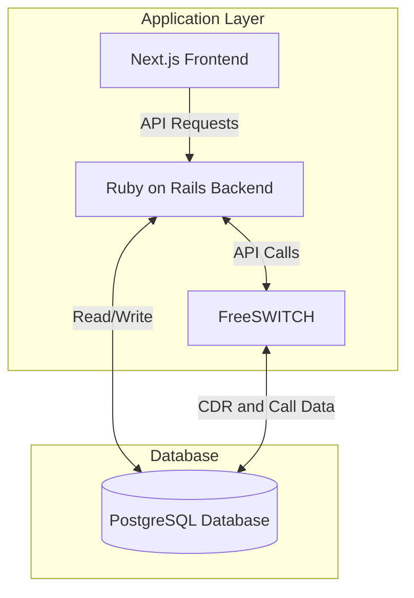

## security considerations:
1. The only way to make a call to postgres is via RoR
2. RoR is only accessible via the frontend, due:
	1. being behind a VPC
	2. having a private IP and port within the VPC
	3. having properly set up CORS 
	4. Ensuring all data requests include a valid UUID
	5. checking rates and anomolous behavior